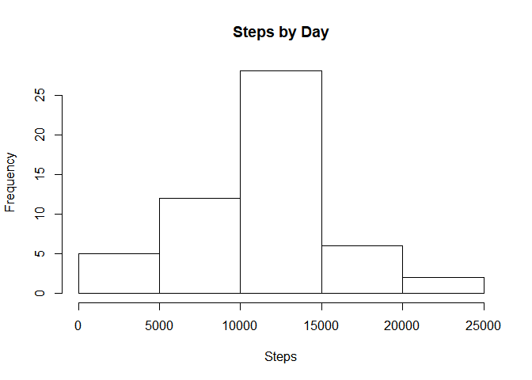
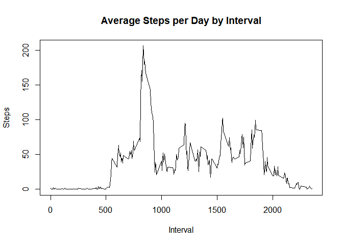
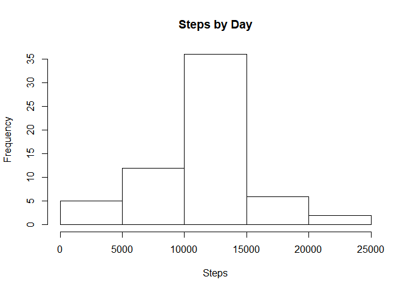
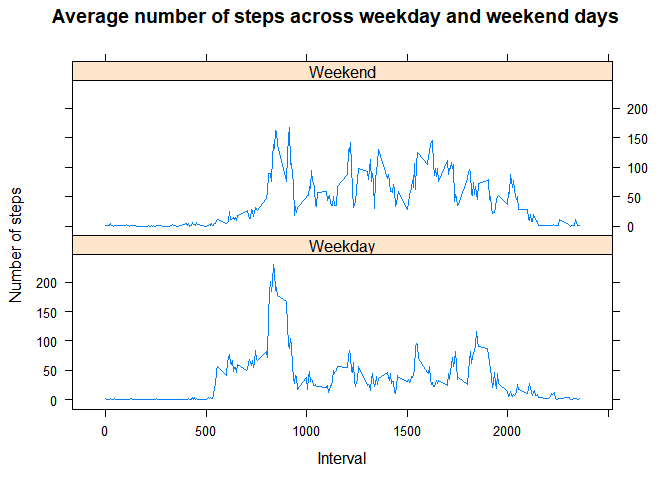

### Synopsis and Data

This report is a submission for the Week 2 Project on Reproducible Research.

It is now possible to collect a large amount of data about personal movement using activity monitoring devices such as a Fitbit, Nike Fuelband, or Jawbone Up. These type of devices are part of the "quantified self" movement - a group of enthusiasts who take measurements about themselves regularly to improve their health, to find patterns in their behavior, or because they are tech geeks. But these data remain under-utilized both because the raw data are hard to obtain and there is a lack of statistical methods and software for processing and interpreting the data.
 

This assignment makes use of data from a personal activity monitoring device. This device collects data at 5 minute intervals through out the day. The data consists of two months of data from an anonymous individual collected during the months of October and November, 2012 and include the number of steps taken in 5 minute intervals each day.

The variables included in this dataset are:

* steps: Number of steps taking in a 5-minute interval (missing values are coded as NA) 
* date: The date on which the measurement was taken in YYYY-MM-DD format
* interval: Identifier for the 5-minute interval in which measurement was taken

There are a total of 17,568 observations in this dataset.


```r
library(lattice)
```
## Loading and preprocessing the data

The data was loaded from the file:


```r
unzip("activity.zip","activity.csv")
data<-read.csv("activity.csv")
```
## What is mean total number of steps taken per day?

The number of steps per day is calculated and represented by the following histogram.


```r
dataDay<-aggregate(steps~date,data,sum)
hist(dataDay$steps, xlab="Steps", main="Steps by Day")
```

<!-- -->

```r
meanDay<-round(mean(dataDay$steps),2)
medianDay<-median(dataDay$steps)
```

The mean and median for the steps taken per day are 10766.19 and 10765 respectively.

## What is the average daily activity pattern?
The following is a time series plot of the 5-minute interval and the average number of steps taken,avergaed across all days.

```r
stepsInterval <- aggregate(steps ~ interval, data, mean)
plot(stepsInterval$interval,stepsInterval$steps, type="l", xlab="Interval", ylab="Steps",main="Average Steps per Day by Interval")
```

<!-- -->

```r
maxInterval <- stepsInterval[which.max(stepsInterval$steps),1]
```

The  5-minute interval that contains the maximum number of steps, on average across all the days in the dataset, is 835.


## Imputing missing values

There are a number of days/intervals where there are missing values (coded as NA). The presence of missing days may introduce bias into some calculations or summaries of the data.


```r
missingValues <- sum(is.na(data$steps))
```
The total number of missing values in the dataset (i.e. the total number of rows with NAs) is 2304.

The `stategy` for imputing missing values (NAs) was to use the mean number of steps for each individual 5-minute interval.

The new dataset, using the orginal dataset with the missing data filled in is created using the following code


```r
data2<-data
missingdata <- is.na(data2$step)
meanInterval <- tapply(data2$steps, data2$interval, mean, na.rm=TRUE, simplify = TRUE)
data2$steps[missingdata] <- meanInterval[as.character(data2$interval[missingdata])]
```


This is the histogram of the total number of steps taken each day using the transformed data (calculated missing values). 


```r
dataDay2<-aggregate(steps~date,data2,sum)
hist(dataDay2$steps, xlab="Steps", main="Steps by Day")
```

<!-- -->

```r
mean2<-mean(dataDay2$steps)
median2<-median (dataDay2$steps)
changemean<-mean(dataDay2$steps)-mean(dataDay$steps)
changemedian<-median(dataDay2$steps)-median(dataDay$steps)
```
The new mean is 10766.19 and the new median is 10766.19. The changes are not significant. For the mean is 0 and for the median is 1.19.


##Are there differences in activity patterns between weekdays and weekends?
New factor variable in the dataset with two levels - "weekday" and "weekend" indicating whether a given date is a weekday or weekend day:

```r
data2$dayType <- ifelse(weekdays(as.Date(data2$date)) %in% c("Monday", "Tuesday", "Wednesday", "Thursday", "Friday"), "Weekday", "Weekend")
head(data2)
```

```
##   steps       date interval dayType
## 1 1.717 2012-10-01        0 Weekday
## 2 0.340 2012-10-01        5 Weekday
## 3 0.132 2012-10-01       10 Weekday
## 4 0.151 2012-10-01       15 Weekday
## 5 0.075 2012-10-01       20 Weekday
## 6 2.094 2012-10-01       25 Weekday
```

```r
table(data2$dayType)
```

```
## 
## Weekday Weekend 
##   12960    4608
```

The following is a time series plot of the 5-minute interval and the average number of steps taken, averaged across all weekday days or weekend days.

```r
mean2data <- aggregate(data2$steps,by=list(data2$dayType,data2$interval), mean)
names(mean2data)<-c("dayType","interval","average")
xyplot(average ~ interval | dayType, mean2data, 
       type="l", 
       lwd=1, 
       xlab="Interval", 
       ylab="Number of steps",
	     main="Average number of steps across weekday and weekend days",	 
       layout=c(1,2))
```

<!-- -->
